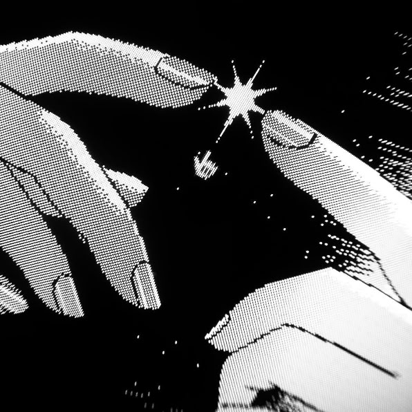

<!-- Banner -->

<!-- Profile Picture in Circle (on top of background style) -->

  

<!-- Name and Bio -->
<h1 align="center">Hi, I’m Mritunjoy 👋</h1>

  B.Tech Computer Science & Engineering student  
  Passionate about coding, design, and creativity 🌟

---

### 🚀 About Me
- 🎓 Currently pursuing **B.Tech in CSE**  
- 💻 Love exploring **tech & design**  
- 🌍 Based in Assam, India  

---

### 📫 Connect with me  
- ✉️ Email: **mritunjoybrahma12345@gmail.com**  
- 🐦 Twitter (optional)  
- 💼 LinkedIn (later)  

---

<!-- Background style (CSS trick using table) -->

  

