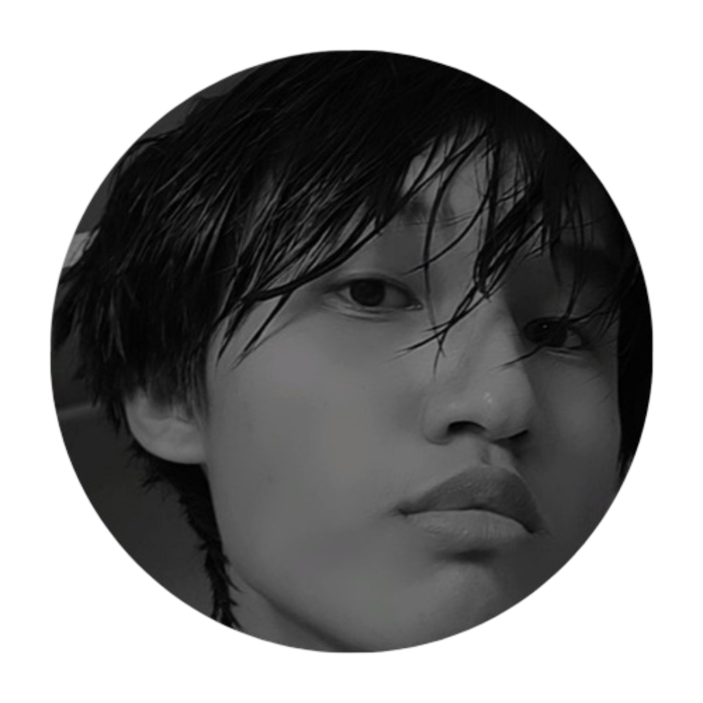

<!-- Banner -->

  

<!-- Profile Picture -->

  

<!-- Name & Tagline -->
<h1 align="center"> Mritunjoy Brahma </h1>

  ✨ Dreaming of Japan 🇯🇵 | Exploring Code & Creativity ✨

---

## 🌸 About Me  
- Japan has always been the **land of my dreams**, where I'd love to build a career combining **creativity and innovation**.  
- Fascinated by **culture, language, and artistic vibes**.  
- Currently learning **Japanese**, along with **C++ and HTML/CSS**.  
- Love playing **story games on PC** and creating **After Effects edits**.  

---

## ⚡ Skills & Tools  

  
  
  
  

---

## 🌐 Connect With Me  

  
  
  

---

## 📍 Personal Info  
- **Location:** Assam, Kokrajhar, India  
- **Contact:** mritunjoybrahma12345@gmail.com  
- **Languages I know:** HTML/CSS, C++, learning Japanese  
- **Other Interests:** PC story games 🎮, After Effects editing 🎬 

---

## 🎯 Future Goals  
- Become fluent in **Japanese** 🇯🇵  
- Build a career combining **design + technology**  
- Create projects that bring **creativity and innovation** together  
- Travel & work in **Japan** one day 🌏 

---

  🌸 *Taking it step by step, focused on turning my dream into reality.* 🌸

  

